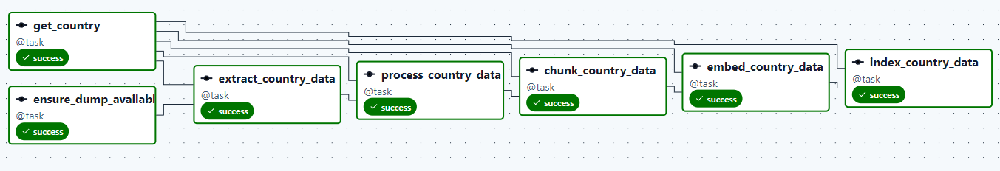
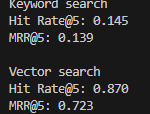
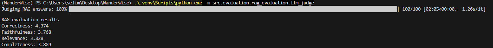
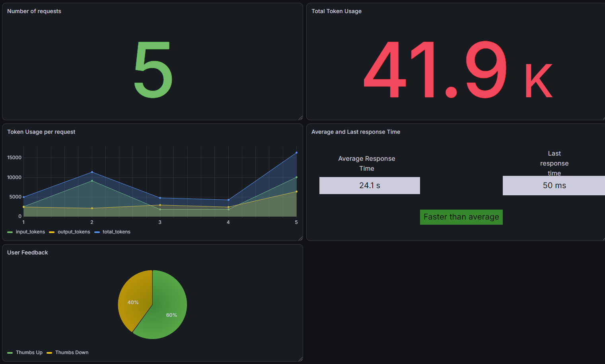

# WanderWise

WanderWise is a travel assistant built with **Retrieval-Augmented Generation (RAG)**.

Users can ask questions about destinations, and WanderWise retrieves relevant travel information before generating a grounded answer.

Examples:

- What are the best things to do in Tunis?
- How can I get around Bangkok?
- When is the best time to visit Sukhothai’s ruins?

## WanderWise v1

WanderWise v1 focuses on building a complete and reproducible travel RAG application.

The current version includes:

- Wikivoyage data ingestion
- Apache Airflow orchestration
- PostgreSQL with pgvector
- Keyword and vector search
- Retrieval evaluation
- Agentic RAG
- OpenAI answer generation
- Local LLM evaluation with Ollama^
- Grafana monitoring dashboard
- Docker Compose containerization

## Travel Knowledge Base

Travel data comes from the official English Wikivoyage dump.

For each country, the pipeline:

```text
Download / reuse Wikivoyage dump
↓
Extract country and destinations
↓
Clean and structure the data
↓
Create chunks
↓
Generate embeddings
↓
Index in PostgreSQL
```

Apache Airflow orchestrates this pipeline.

Countries are stored in a configuration file. Airflow periodically checks for new countries and automatically starts a separate ingestion run for each one.

Each pipeline step is its own Airflow task, making failures and retries easy to track.

### Airflow Ingestion Pipeline



## Search and Retrieval

WanderWise supports:

- PostgreSQL full-text keyword search
- Semantic vector search with pgvector

Both approaches were evaluated using:

- Hit Rate@5
- Mean Reciprocal Rank at 5

### Search Evaluation



Vector search performed better and is used as the main retrieval method.

## Agentic RAG

Vector search is exposed to the model as a tool.

The model can decide:

- When search is needed
- What to search for
- Whether more context is needed
- When enough information has been retrieved

```text
User Question
↓
LLM
↓
Travel Search Tool
↓
Vector Search
↓
Retrieved Context
↓
Grounded Answer
```

The final answer is generated using the OpenAI API.

## RAG Evaluation

The complete RAG pipeline is evaluated using a local Ollama model as an LLM judge.

The evaluation focuses on:

- Correctness
- Faithfulness
- Relevance
- Completeness

### LLM Evaluation



## Monitoring

WanderWise stores interaction metrics in PostgreSQL and visualizes them with Grafana.

The monitoring dashboard includes:

- Number of requests
- Total token usage
- Input, output, and total tokens per request
- Average and latest response time
- User thumbs up/down feedback

### Grafana Monitoring Dashboard

<p align="center">
  
</p>

The Grafana dashboard configuration is exported as JSON and stored in the `grafana/` folder

## Application

WanderWise provides a Streamlit web interface where users can ask travel questions and receive grounded answers generated by the RAG pipeline.

Users can also rate answers with thumbs up/down feedback. The feedback is stored together with interaction metrics in PostgreSQL and can be analyzed in Grafana.

## Running WanderWise

Create a `.env` file in the project root:

```env
OPENAI_API_KEY=your_openai_api_key
```

Build and start all services:

```bash
docker compose up --build -d
```

Check that everything is running:

```bash
docker compose ps
```

Open:

- WanderWise: http://localhost:8501
- Airflow: http://localhost:8080
- Grafana: http://localhost:3000

Stop all services:

```bash
docker compose down
```

## v1 Architecture

```text
Wikivoyage
↓
Apache Airflow
↓
Data Ingestion
↓
PostgreSQL + pgvector
↓
Vector Search
↓
Agentic RAG
↓
OpenAI Answer Generation
↓
Evaluation
↓
User Interface
↓
Monitoring
```

## Goal of v1

The goal is to build a small, complete, evaluated, and reproducible travel RAG application before adding more advanced travel features.

## Future Versions

### WanderWise v2 — Travel Data Platform

Possible additions:

- More destinations
- Additional travel data sources
- Better metadata and filtering
- Improved retrieval
- Conversation history
- More tools

### WanderWise v3 — Live Travel Intelligence

Future versions can include live data such as:

- Weather
- Currency
- Transportation
- Travel APIs
- Real-time destination information
